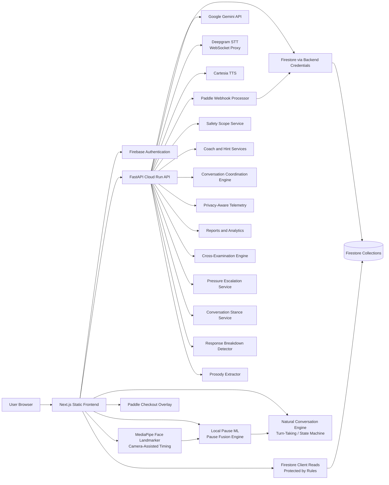
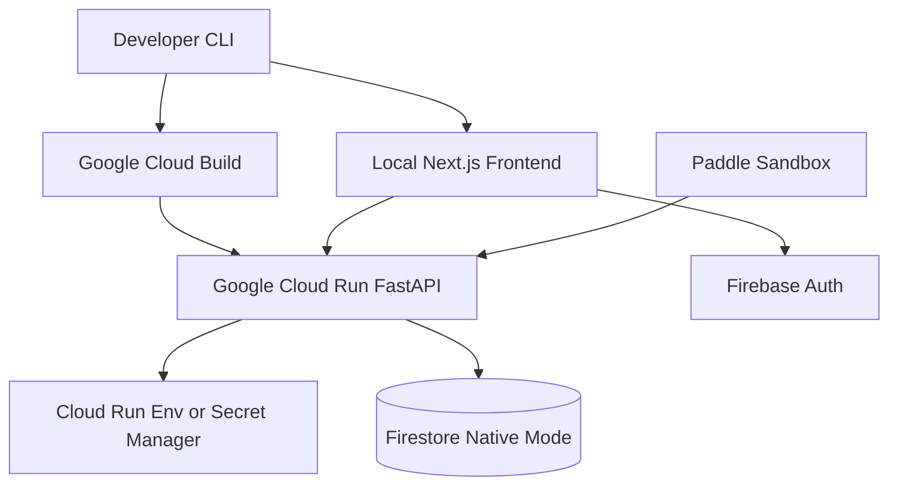

# RehearseAI Architecture

This document explains RehearseAI for reviewers and technical evaluators. It covers how the major parts of the application work together, where data moves, and how the system is designed to align with international software, security, privacy, accessibility, and AI governance standards.

RehearseAI is not claiming external certification. The current posture is standards-aligned: the architecture uses controls and documentation patterns that map to ISO/IEC, OWASP, GDPR-style privacy principles, WCAG accessibility goals, and cloud reliability practices.

## Executive Summary

RehearseAI is a cognitive performance training platform. Users rehearse high-pressure conversations, receive AI coaching, build recurring practice routines, complete structured course programs, and review reports with 15-metric analytics. Subscriptions and course packages are sold through Paddle Billing v2 with a live webhook-driven entitlement pipeline.

The system has six core layers:

- **Web application** — Next.js, React, TypeScript, Tailwind CSS, Firebase Auth.
- **API boundary** — FastAPI running on Google Cloud Run.
- **Intelligence services** — Gemini for roleplay and report generation; rule-based coaching, safety, conversation coordination, pressure escalation, cross-examination, stance selection, response breakdown, and prosody extraction.
- **Data layer** — Google Firestore with security rules, admin-controlled writes, audit logs, revenue and churn registers, webhook error tracking, and privacy-aware telemetry.
- **Billing pipeline** — Paddle Billing v2 checkout, webhook processor, and entitlement sync.
- **External integrations** — Deepgram speech-to-text, Cartesia text-to-speech, and Google Cloud deployment services.

## Architecture Diagram

## Component Responsibilities

| Component | Location | Responsibility |
| --- | --- | --- |
| Web app | `frontend/app`, `frontend/components`, `frontend/lib` | User experience, auth, practice/session flow, courses, dashboard, billing UI, admin views, reports, progress tracking, SEO landing pages, content, and legal pages. |
| API | `backend/app/main.py`, `backend/app/routes` | Stable service boundary for sessions, reports, courses, practice schedules, voice, telemetry, subscriptions, Paddle webhooks, contact forms, and admin operations. |
| Service layer | `backend/app/services` | Business logic for Firestore, Gemini, reports, voice providers, courses, gamification, notifications, telemetry, safety, coaching, cross-examination, pressure escalation, stance selection, response breakdown, prosody extraction, and Paddle billing. |
| Data models | `backend/app/models`, `frontend/lib/types.ts` | Request/response and persisted domain structures shared conceptually across backend and frontend. |
| Prompts | `backend/app/prompts` | Roleplay and report prompt templates with multilingual instructions and controlled output expectations. |
| Natural conversation engine | `frontend/lib/conversation` | Client-side state machine and turn-taking logic that decides when the user has finished speaking without requiring push-to-talk. |
| MediaPipe face tracking | `frontend/lib/mediapipe` | Loads the MediaPipe Face Landmarker WASM model in-browser to extract face-presence and blink/gaze signals that improve turn-taking timing accuracy. |
| Local ML signals | `frontend/lib/local-signals`, `frontend/lib/local-ml` | Pause fusion engine combining voice timing and camera signals into a single pause-intent decision. Rule-based now; designed for future ONNX/TFLite model swap. |
| Paddle billing | `backend/app/services/paddle_service.py`, `frontend/lib/paddle.ts` | Checkout integration, webhook processing, entitlement sync, and revenue/churn event logging. |
| Database | Firestore | Full application state including identity, practice, courses, billing, revenue ops, telemetry, and admin logs. |
| Security rules | `firestore.rules` | Client-side data access restrictions for user-owned and admin-only collections. |
| ML scaffold | `backend/ml` | Offline classifier training placeholders for future consented telemetry learning. |

## Runtime Request Flows

### Session Creation and Roleplay

1. User signs in with Firebase Auth.
2. Frontend collects practice type, difficulty, topic, goals, language preferences, and session duration.
3. Frontend calls `POST /api/sessions`.
4. FastAPI creates a session in Firestore.
5. User sends a message through `POST /api/sessions/{session_id}/message`.
6. Backend stores the user turn, checks recent history, applies safety/coaching logic, calls Gemini or mock fallback, and stores the AI turn.
7. Frontend renders the response as text and plays audio through Cartesia TTS or browser `speechSynthesis`.

### Voice Mode

1. Browser records microphone chunks after user permission.
2. Frontend opens `/ws/voice/deepgram`.
3. FastAPI proxies audio to Deepgram using the backend-only `DEEPGRAM_API_KEY`.
4. Deepgram transcript events return through the WebSocket to the browser.
5. The browser sends confirmed text to the normal session message endpoint.
6. If Deepgram or the proxy fails, the client falls back to browser speech recognition.

### Natural Conversation Mode

1. User enables natural mode via `ConversationModeToggle`.
2. `conversationStateMachine.ts` tracks state across `idle → listening → user_speaking → user_thinking → ready_to_send → processing_ai → ai_speaking` and back.
3. On every silence tick, `naturalTurnTakingEngine.ts` evaluates silence duration, transcript content, Deepgram endpointing events, and optional camera signals to produce a `NaturalTurnDecision`.
4. When the MediaPipe face landmarker is active, `faceLandmarkerService.ts` streams face-presence and micro-expression data to `faceSignalRuleEngine.ts`, emitting a `FaceConversationSignal`.
5. `pauseFusionEngine.ts` combines voice timing and camera signals through `localFeatureExtractor.ts` and `localPauseClassifier.ts` to produce a single `PauseFusionDecision` with an adaptive wait window.
6. The turn-taking engine passes the decision back to the state machine, which either continues listening or fires the send event.
7. After the AI responds, the state machine transitions through `processing_ai → ai_speaking → listening`, preventing double-capture of AI audio.
8. Users calibrate personal silence thresholds at `/voice-calibration`.

### Courses and Intake

1. User creates a course through the 5-step `CourseGenerator` wizard (Goal / Situation / Arenas + Weak Spots / Commitment / Self-Assessment) or enrolls in a course template.
2. Before scheduling begins, `CourseIntakeWizard` collects situation context, event date, weak spots, confidence, and practice frequency through a 3-step animated form.
3. `IntakeAnswers` (situation, eventDate, weakSpots, confidenceLevel, practiceFrequency) are stored on the course document and fed into the session AI system prompt as briefing context.
4. Difficulty is auto-suggested from the average of confidence and frequency self-ratings.
5. Course sessions generate practice missions over time. Users track progress, streak, and skill growth on the course detail page.
6. When `completedSessions === totalSessions`, the course detail page renders a completion banner with a share button and a link to the progress view.

### Pre-Event Countdown

1. `EventCountdownCard` queries active courses where `intakeAnswers.eventDate` is in the future.
2. Results are sorted by proximity and displayed on the dashboard Today tab with urgency colouring (red ≤ 3 days, amber ≤ 7 days, violet otherwise).
3. The card links directly to the course detail page.

### Billing — Paddle Webhook Pipeline

1. User clicks a pricing CTA; `openCheckout(priceId, uid, email)` opens the Paddle overlay with `customData: { uid }`.
2. After payment, Paddle fires a webhook to `POST /api/payments/paddle/webhook`.
3. `PaddleService.process_webhook()` reads `custom_data.uid` and `event_type`:
   - `subscription.created/activated/updated` → `admin_assign_plan(uid, {...})` sets the user's plan in `userEntitlements` and writes a record to `revenueTransactions`.
   - `subscription.canceled` → downgrades to free plan, writes to `revenueTransactions` (status: canceled), and writes a detailed record to `churnEvents` including Paddle's cancellation reason and comment.
   - `transaction.completed` → finds the matching package by price ID, writes an `ArrayUnion` purchase to `userEntitlements/{uid}.purchases`, and logs to `revenueTransactions`.
4. Any processing failure or missing UID writes a record to `webhookErrors` for admin review.
5. The frontend `BillingSection` listens for the `paddle:payment-complete` DOM event and refreshes entitlement data after a 3-second webhook propagation delay.

### Revenue and Operations Logging

- `revenueTransactions` — one document per webhook event; fields: uid, eventType, productType, amount, currency, planId/packageId, Paddle IDs, status, createdAt.
- `churnEvents` — one document per cancellation; includes Paddle-reported reason, comment, effectiveAt date.
- `webhookErrors` — one document per processing failure; includes eventType, uid, error message, payload snapshot (truncated to 2000 chars), and resolved flag.
- Admin pages at `/admin/revenue`, `/admin/churn`, and `/admin/webhook-errors` provide real-time visibility with refresh controls.

### Longitudinal Progress

1. On completing a session, analytics are stored in `analytics/{id}` with `userId`, `createdAt`, and a `MetricScores` object (15 dimensions, 0–100 each).
2. `/progress` queries the user's analytics ordered by `createdAt`, computes per-metric value series, and renders SVG sparklines inline without an external charting library.
3. Trend badges compare the last 3 sessions against prior sessions to show improving / stable / declining.
4. Top 3 strengths and bottom 3 areas to work on are derived from the most recent session's scores.

### Report and Analytics

1. User ends a session manually or the selected duration expires.
2. Frontend calls `POST /api/sessions/{session_id}/report`.
3. Backend generates or reuses a structured report.
4. Gemini produces report text when configured; the mock report path keeps the product demonstrable without credentials.
5. Analytics services create scorecards, timelines, trend views, reasoning summaries, and recommended drills.
6. Frontend loads the report through `GET /api/reports/{report_id}` and analytics through `GET /api/reports/{report_id}/analytics`.

### Adaptive Pressure and Cross-Examination

1. On each AI turn, `response_breakdown_service.py` scans the user transcript for filler words, confusion markers, vague language, avoidance patterns, and evidence markers, producing a `ResponseBreakdown` and a `LikelyCause`.
2. `prosody_extractor.py` extracts RMS energy and F0 from the audio chunk using librosa (pure-Python RMS fallback) to enrich coaching signals.
3. `conversation_stance_service.py` maps the session mode, breakdown level, pressure level, and turn count to a `ConversationStance` (supportive → hostile continuum).
4. `pressure_escalation_service.py` produces the next `PressureDecision` including the new pressure integer and an `AiAction` flag.
5. `cross_examination_service.py` selects persona-specific attack vectors, detects weak/evidence/evasion markers, and injects a follow-up challenge question into the prompt.
6. `conversation_coordination_service.py` assembles the final Gemini prompt with the correct stance, pressure, and cross-examination instructions.

### Admin Operations

1. Admin users access `/admin` pages in the frontend.
2. Admin APIs manage plans, products, users, entitlements, contact messages, practice templates, course templates, telemetry labels, and safety events.
3. `adminLogs/{logId}` records sensitive administrative changes.
4. The revenue, churn, and webhook error registers give operational visibility into the billing pipeline.

## Data Architecture

Firestore is the source of truth for all application state.

| Group | Collections |
| --- | --- |
| Identity | `users`, `userEntitlements`, `userSessionCounters`, `plans`, `featureUsage` |
| Practice | `sessions`, `sessions/{id}/messages`, `reports`, `analytics`, `reasoningTrees`, `historicalPerformance` |
| Habits | `practiceSchedules`, `practiceHistory`, `notifications`, `achievements`, `userProgress` |
| Courses | `courses`, `courseModules`, `courseSessions`, `courseProgress`, `courseTemplates`, `coursePackages` |
| Billing | `billing_customers`, `billing_subscriptions`, `billing_checkouts` |
| Revenue ops | `revenueTransactions`, `churnEvents`, `webhookErrors` |
| Operations | `adminLogs`, `contactMessages`, `safetyEvents` |
| Telemetry | `conversationTelemetry`, `sessionOutcomes`, `voiceProfiles`, `privacySettings`, `telemetryLabels` |

Backend writes using Firebase Admin SDK bypass Firestore security rules by design. Client reads and writes must satisfy `firestore.rules`. Revenue ops collections (`revenueTransactions`, `churnEvents`, `webhookErrors`) are admin-read-only from the frontend.

## Security Architecture

The target security model follows least privilege and defense in depth:

- **Authentication** — Firebase Auth for email/password, Google sign-in, password reset, and identity tokens.
- **Authorization** — Firestore rules for direct client reads/writes; backend/admin authorization for privileged APIs.
- **Secrets** — API keys stay in backend `.env`, Cloud Run environment variables, or Secret Manager. Frontend variables are limited to `NEXT_PUBLIC_*` values.
- **Data ownership** — users read their own sessions, reports, entitlements, courses, schedules, and history.
- **Admin isolation** — admin-only collections and APIs manage billing metadata, entitlements, plans, logs, contact messages, templates, safety events, revenue, and churn.
- **Network boundary** — browsers call FastAPI and Firebase; browsers never call Gemini, Deepgram, Cartesia, or Paddle with private credentials.
- **Paddle webhooks** — webhook secret should be verified before billing goes live in production.
- **Auditability** — admin operations write `adminLogs`; billing events write `revenueTransactions`; churn events write `churnEvents`; webhook failures write `webhookErrors`.

Production hardening checklist:

- Verify Firebase ID tokens in FastAPI for every user-specific and admin route.
- Move admin checks to Firebase custom claims.
- Enforce Paddle webhook signature verification before billing goes live.
- Use Google Cloud Secret Manager and avoid long-lived local service account keys.
- Add API rate limits by user ID and IP.
- Add centralised logging, alerting, and incident response runbooks.

## Privacy Architecture

RehearseAI is designed around data minimization:

- Raw audio is not stored by default.
- Voice providers are accessed through backend proxy services.
- Conversation telemetry stores timing and transcript-derived features instead of private recordings.
- Users have settings for telemetry, model improvement, and raw audio storage.
- Detailed telemetry has an `expiresAt` field and cleanup script.
- Training exports are anonymised and remove direct identifiers.

| Principle | RehearseAI Control |
| --- | --- |
| Lawfulness and transparency | Privacy, terms, cookies, refund, subscription, contact, and account deletion pages. |
| Purpose limitation | Telemetry documented for conversation timing and future classifier improvement. |
| Data minimization | No raw audio storage by default; short AI history window; report reuse. |
| Accuracy | Users view reports and historical trends; generated feedback is scoped as training support. |
| Storage limitation | Detailed telemetry expiry and cleanup script. |
| Integrity and confidentiality | Backend-only secrets, Firestore rules, service-account writes, and CORS controls. |
| User rights | Soft deletion request endpoint and settings page foundations. |

## AI Governance

- Gemini roleplay uses `GEMINI_ROLEPLAY_MODEL` for short live responses.
- Gemini report generation uses `GEMINI_MODEL` with output token caps.
- Mock fallback keeps the MVP usable without AI credentials.
- The backend limits conversation history through `AI_HISTORY_MESSAGES`.
- Safety scope services and prompt constraints keep the product in coaching/training territory.
- Future ML classifiers are offline/admin-only and must pass evaluation thresholds before runtime use.
- Rule-based fallbacks remain available when classifier confidence is low.
- Intake answers feed the session AI system prompt as structured context — they are not used for model training.

The app should be evaluated as an AI-assisted coaching product, not a medical, legal, financial, or emergency service.

## Reliability and Scalability

The architecture is horizontally scalable because the frontend can be hosted separately and the backend is stateless between requests:

- The frontend can be served from any static hosting target.
- Cloud Run scales FastAPI instances based on traffic.
- Firestore provides managed document storage and indexing.
- WebSocket voice sessions use FastAPI as a proxy and should be monitored separately from HTTP traffic.
- Billing webhook failures are logged to `webhookErrors` for async recovery rather than causing silent data loss.

Key operational checks:

- `/health` confirms API availability.
- Cloud Run logs should be monitored for provider failures, CORS errors, and quota issues.
- Firestore indexes must be deployed for query-heavy admin and dashboard screens.
- AI and voice provider usage should be tracked against monthly budgets.
- `/admin/webhook-errors` should be reviewed regularly; unresolved entries indicate missed entitlement syncs.

## International Standards Alignment

| Standard or Framework | How RehearseAI Aligns |
| --- | --- |
| ISO/IEC 27001 | Documents asset boundaries, access control, secrets handling, audit logging, revenue logging, and production hardening actions. |
| ISO/IEC 25010 | Addresses functional suitability, reliability, usability, maintainability, portability, security, and compatibility through modular services and typed frontend/backend code. |
| ISO/IEC 42001 | Documents AI system purpose, model boundaries, intake-to-prompt data flow, fallback behaviour, telemetry governance, and evaluation requirements before ML deployment. |
| OWASP ASVS | Uses authenticated sessions, role separation, backend-only secrets, CORS controls, input validation through Pydantic, and planned token verification/rate limiting. |
| OWASP Top 10 | Reduces exposure to broken access control, sensitive data exposure, insecure design, and security misconfiguration through service boundaries and rules. |
| GDPR-style privacy | Applies minimization, retention limits, consent settings, user deletion request flow, and anonymised exports. |
| WCAG 2.2 | Frontend maintains keyboard access, semantic structure, readable contrast, responsive layout, and clear error states. All interactive controls have accessible labels. |
| NIST AI RMF | Identifies AI purpose, maps risks, applies guardrails/fallbacks, and prepares measurement through telemetry labels and evaluation metadata. |

## Deployment Topology

Production targets:

- Frontend: local/private testing at `http://localhost:3000`
- Backend: `https://rehearseai-backend-805488057071.us-central1.run.app`
- Repository: `https://github.com/salkhan-ops/rehearseai`
- Google Cloud project: `rehearseai-prod`

## Review Checklist

- Clear separation of frontend, API, data, AI, voice, billing, and admin responsibilities.
- Backend protects all private provider credentials — Gemini, Deepgram, Cartesia, Paddle.
- Firestore rules restrict direct browser access to user-owned and admin-only data.
- Paddle webhook pipeline syncs entitlements and logs every billing event to Firestore.
- Revenue, churn, and webhook error registers give operational visibility without requiring external analytics tools.
- Privacy design avoids raw audio storage by default.
- AI behaviour has cost controls, model fallback, and safety boundaries.
- Intake answers enrich the AI system prompt per-session and are not used for model training.
- Longitudinal progress view aggregates per-session metrics without requiring a separate analytics database.
- Multilingual support includes English, Arabic, Urdu, Hindi, Spanish, and French.
- Architecture supports local demo, cloud deployment, and future production hardening.
- Standards alignment is documented without overstating certification status.
- Natural conversation mode eliminates push-to-talk with a client-side state machine and adaptive silence timing.
- Camera-assisted timing uses MediaPipe in-browser — no video leaves the device.
- Local ML pause classifier is rule-based with a documented upgrade path to ONNX/TFLite — no emotion or medical inference is claimed.
- Adaptive pressure pipeline (response breakdown → stance → escalation → cross-examination) is rule-driven and bounded by the safety scope service.
