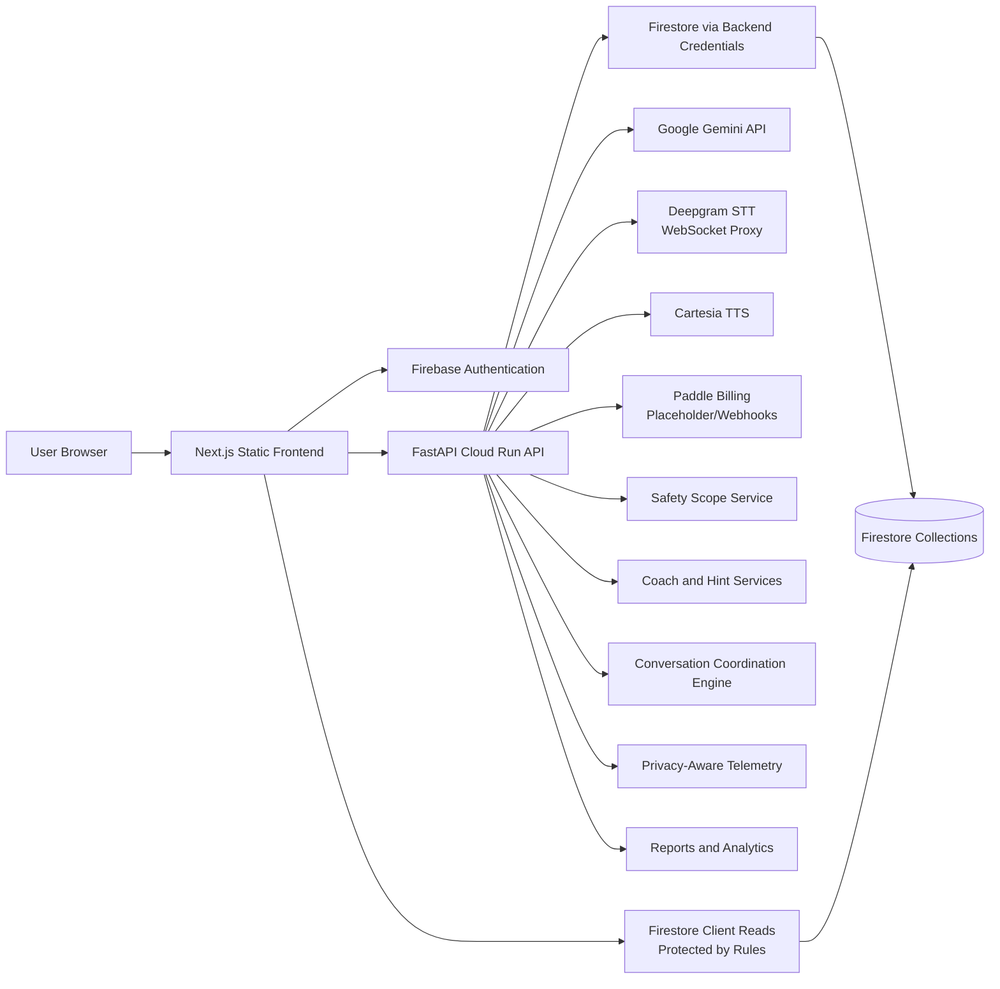
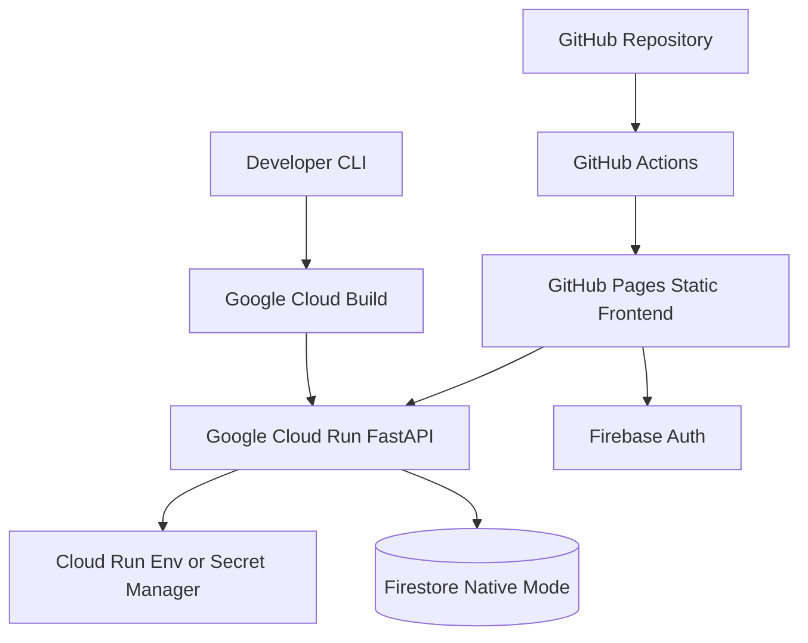

# RehearseAI Architecture

This document explains RehearseAI for judges, reviewers, and technical evaluators. It shows how the major parts of the application work together, where data moves, and how the MVP is designed to align with international software, security, privacy, accessibility, and AI governance standards.

RehearseAI is not claiming external certification. The current posture is standards-aligned: the architecture uses controls and documentation patterns that map to ISO/IEC, OWASP, GDPR-style privacy principles, WCAG accessibility goals, and cloud reliability practices.

## Executive Summary

RehearseAI is a cognitive performance training platform. Users rehearse high-pressure conversations, receive AI coaching, build recurring practice routines, and review structured reports with analytics.

The system has five core layers:

- Static web application: Next.js, React, TypeScript, Tailwind CSS, and Firebase Auth.
- API boundary: FastAPI running on Google Cloud Run.
- Intelligence services: Gemini for roleplay/report generation, rule-based coaching, safety scope checks, conversation coordination, and future ML classifiers.
- Data layer: Google Firestore with security rules, admin-controlled writes, audit logs, and privacy-aware telemetry.
- External integrations: Deepgram speech-to-text, Cartesia text-to-speech, Paddle subscription placeholders, and Google Cloud deployment services.

## Architecture Diagram

## Component Responsibilities

| Component | Location | Responsibility |
| --- | --- | --- |
| Web app | `frontend/app`, `frontend/components`, `frontend/lib` | User experience, authentication screens, practice/session flow, dashboard, admin views, reports, content, legal pages, and client API calls. |
| API | `backend/app/main.py`, `backend/app/routes` | Stable service boundary for sessions, reports, courses, practice schedules, voice, telemetry, subscriptions, contact forms, and admin operations. |
| Service layer | `backend/app/services` | Business logic for Firestore, Gemini, reports, voice providers, courses, gamification, notifications, telemetry, safety, and coaching. |
| Data models | `backend/app/models`, `frontend/lib/types.ts` | Request/response and persisted domain structures shared conceptually between backend and frontend. |
| Prompts | `backend/app/prompts` | Roleplay and report prompt templates with multilingual instructions and controlled output expectations. |
| Database | Firestore | Users, sessions, messages, reports, analytics, billing metadata, entitlements, courses, practice routines, telemetry, contact messages, and audit logs. |
| Security rules | `firestore.rules` | Client-side data access restrictions for user-owned and admin-only collections. |
| ML scaffold | `backend/ml` | Offline classifier training placeholders for future consented telemetry learning. |

## Runtime Request Flow

### Session Creation and Roleplay

1. User signs in with Firebase Auth or continues through supported guest-style MVP flows.
2. Frontend collects practice type, difficulty, topic, goals, language preferences, and session duration.
3. Frontend calls `POST /api/sessions`.
4. FastAPI creates a session in Firestore or in-memory storage when Firestore is not configured.
5. User sends a message through `POST /api/sessions/{session_id}/message`.
6. Backend stores the user turn, checks recent history, applies safety/coaching logic, calls Gemini or mock fallback, and stores the AI turn.
7. Frontend renders the response as text and can play audio through browser speech synthesis or `POST /api/voice/tts`.

### Voice Mode

1. Browser records microphone chunks after user permission.
2. Frontend opens `/ws/voice/deepgram`.
3. FastAPI proxies audio to Deepgram using the backend-only `DEEPGRAM_API_KEY`.
4. Deepgram transcript events return through the WebSocket to the browser.
5. The browser sends confirmed text to the normal session message endpoint.
6. If Deepgram or the proxy fails, the client falls back to browser speech recognition/mock voice behavior.

### Report and Analytics

1. User ends a session manually or the selected duration expires.
2. Frontend calls `POST /api/sessions/{session_id}/report`.
3. Backend generates or reuses a structured report.
4. Gemini produces report text when configured; otherwise the mock report path keeps the product demonstrable.
5. Analytics services create scorecards, timelines, trend views, reasoning summaries, and recommended drills.
6. Frontend loads report detail through `GET /api/reports/{report_id}` and analytics through `GET /api/reports/{report_id}/analytics`.

### Courses and Practice Habits

1. Users create or enroll in reasoning courses through `/api/courses/*`.
2. Course sessions generate practice missions over time.
3. Users can create recurring schedules through `/api/practice-schedules`.
4. Daily challenges and quick-start scenarios come from `/api/users/{user_id}/daily-challenge`, `/api/scenarios/random`, and `/api/scenarios/quick-start`.
5. Completion updates practice history, progress, achievements, and notifications.

### Admin Operations

1. Admin users access `/admin` pages in the frontend.
2. Admin APIs manage plans, products, users, entitlements, contact messages, practice templates, course templates, telemetry labels, and safety events.
3. Admin actions should be backed by Firebase Admin token verification and custom claims before production release.
4. `adminLogs/{logId}` records sensitive administrative changes.

## Data Architecture

Firestore is the source of truth for application state. The main collections are:

- Identity and access: `users`, `userEntitlements`, `plans`, `featureUsage`
- Practice: `sessions`, `sessions/{sessionId}/messages`, `reports`, `analytics`, `reasoningTrees`, `historicalPerformance`
- Habits: `practiceSchedules`, `practiceHistory`, `notifications`, `achievements`, `userProgress`
- Courses: `courses`, `courseModules`, `courseSessions`, `courseProgress`, `courseTemplates`
- Billing: `billing_customers`, `billing_subscriptions`, `billing_checkouts`
- Operations: `adminLogs`, `contactMessages`, `safetyEvents`
- Telemetry and ML: `conversationTelemetry`, `sessionOutcomes`, `voiceProfiles`, `privacySettings`, `telemetryLabels`

Backend writes using Firebase Admin SDK or Google service-account credentials bypass Firestore security rules by design. Client reads and writes must satisfy `firestore.rules`.

## Security Architecture

The target security model follows least privilege and defense in depth:

- Authentication: Firebase Auth for email/password, Google sign-in, password reset, and identity tokens.
- Authorization: Firestore rules for direct client reads/writes; backend/admin authorization for privileged APIs.
- Secrets: API keys stay in backend `.env`, Cloud Run environment variables, or Secret Manager. Frontend variables are limited to `NEXT_PUBLIC_*` values.
- Data ownership: users read their own sessions, reports, entitlements, courses, schedules, and history.
- Admin isolation: admin-only collections and APIs manage billing metadata, entitlements, plans, logs, contact messages, templates, and safety events.
- Network boundary: browsers call FastAPI and Firebase; browsers never call Gemini, Deepgram, Cartesia, or Paddle with private credentials.
- Auditability: admin operations write `adminLogs`; contact and billing status changes are persisted.

Production hardening checklist:

- Verify Firebase ID tokens in FastAPI for every user-specific and admin route.
- Move admin checks to Firebase custom claims.
- Enforce Paddle webhook signature verification before billing goes live.
- Use Google Cloud Secret Manager and avoid long-lived local service account keys in production.
- Add API rate limits by user ID and IP.
- Add centralized logging, alerting, and incident response runbooks.

## Privacy Architecture

RehearseAI is designed around data minimization:

- Raw audio is not stored by default.
- Voice providers are accessed through backend proxy services.
- Conversation telemetry stores timing and transcript-derived features instead of private recordings.
- Users have settings for telemetry, model improvement, and raw audio storage.
- Detailed telemetry has an `expiresAt` field and cleanup script.
- Training exports are anonymized and remove direct identifiers.

Privacy controls map to GDPR-style principles:

| Principle | RehearseAI Control |
| --- | --- |
| Lawfulness and transparency | Privacy, terms, cookies, refund, subscription, contact, and account deletion pages. |
| Purpose limitation | Telemetry is documented for conversation timing and future classifier improvement. |
| Data minimization | No raw audio storage by default; short AI history window; report reuse. |
| Accuracy | Users can view reports and historical trends; generated feedback is scoped as training support. |
| Storage limitation | Detailed telemetry expiry and cleanup script. |
| Integrity and confidentiality | Backend-only secrets, Firestore rules, service-account writes, and CORS controls. |
| User rights | Soft deletion request endpoint and settings page foundations. |

## AI Governance

The AI layer is intentionally bounded:

- Gemini roleplay uses `GEMINI_ROLEPLAY_MODEL` for short live responses.
- Gemini report generation uses `GEMINI_MODEL` with output token caps.
- Mock fallback keeps the MVP usable without AI credentials.
- The backend limits conversation history through `AI_HISTORY_MESSAGES`.
- Safety scope services and prompt constraints keep the product in coaching/training territory.
- Future ML classifiers are offline/admin-only and must pass evaluation thresholds before runtime use.
- Rule-based fallbacks remain available when classifier confidence is low.

The app should be evaluated as an AI-assisted coaching product, not a medical, legal, financial, or emergency service.

## Reliability and Scalability

The architecture is horizontally scalable because the frontend is static and the backend is stateless between requests:

- Static frontend can be served from GitHub Pages or another CDN-style host.
- Cloud Run scales FastAPI instances based on traffic.
- Firestore provides managed document storage and indexing.
- WebSocket voice sessions use FastAPI as a proxy and should be monitored separately from normal HTTP traffic.
- Mock/in-memory fallbacks support local demos but are not production persistence.

Key operational checks:

- `/health` confirms API availability.
- Cloud Run logs should be monitored for provider failures, CORS errors, and quota issues.
- Firestore indexes must be deployed for query-heavy admin/dashboard screens.
- AI and voice provider usage should be tracked against monthly budgets.

## International Standards Alignment

| Standard or Framework | How RehearseAI Aligns |
| --- | --- |
| ISO/IEC 27001 | Documents asset boundaries, access control, secrets handling, audit logging, and production hardening actions. |
| ISO/IEC 25010 | Addresses functional suitability, reliability, usability, maintainability, portability, security, and compatibility through modular services and typed frontend/backend code. |
| ISO/IEC 42001 | Documents AI system purpose, model boundaries, fallback behavior, telemetry governance, and evaluation requirements before ML deployment. |
| OWASP ASVS | Uses authenticated sessions, role separation, backend-only secrets, CORS controls, input validation through Pydantic, and planned token verification/rate limiting. |
| OWASP Top 10 | Reduces exposure to broken access control, sensitive data exposure, insecure design, and security misconfiguration through service boundaries and rules. |
| GDPR-style privacy | Applies minimization, retention limits, consent settings, user deletion request flow, and anonymized exports. |
| WCAG 2.2 | Frontend should maintain keyboard access, semantic structure, readable contrast, responsive layout, and clear error states. |
| NIST AI RMF | Identifies AI purpose, maps risks, applies guardrails/fallbacks, and prepares measurement through telemetry labels and evaluation metadata. |

## Deployment Topology

Production targets:

- Frontend: `https://salkhan-ops.github.io/rehearseai/`
- Backend: `https://rehearseai-backend-805488057071.us-central1.run.app`
- Repository: `https://github.com/salkhan-ops/rehearseai`
- Google Cloud project: `rehearseai-prod`

## Judge Review Checklist

- Clear separation of frontend, API, data, AI, voice, billing, and admin responsibilities.
- Backend protects private provider credentials.
- Firestore rules restrict direct browser access.
- Privacy design avoids raw audio storage by default.
- AI behavior has cost controls, model fallback, and safety boundaries.
- Multilingual support includes English, Arabic, Urdu, Hindi, Spanish, and French.
- Architecture supports local demo, cloud deployment, and future production hardening.
- Standards alignment is documented without overstating certification status.

